# Hansa Field — mapa conceptual de la evolución

> Decisiones confirmadas el 2026-09-08: Dataset neutral y grupo opcional. B1 ya no bloquea implementación. El usuario autorizó reset de desarrollo y un baseline limpio, sin migración histórica. Los diagramas son el objetivo; no implican que todas las funcionalidades estén conectadas todavía.

Fecha: 2026-09-08. **Arquitectura propuesta, no implementada.** Leer decisiones y fases en el [plan](HANSA-FIELD-IMPLEMENTATION-PLAN.md).

Idea central: el molde no es el dato; el lugar de nacimiento no se borra; participar no es copiar; vincular no es fusionar. La propuesta de colección neutral para datos locales necesita la confirmación B1 del plan.

## Mapa 1 — Entidades principales

- **Plantilla:** molde reutilizable, sin registros.
- **App:** dataset operativo visible en el catálogo.
- **Colección/Dataset:** soporte común de schema y registros; puede ser de App o local de Proyecto. No duplica registros ni exige otra pantalla.
- **Proyecto:** contexto de trabajo, puede estar vacío.
- **Cajón:** receta de configuración.
- **Record:** representación individual con UUID y baseline.
- **ProjectApp:** configuración de una App relacionada con un Proyecto.
- **ProjectRecord:** participación editable localmente.
- **Territorio:** ubicación/asignación configurable.
- **Grupo:** equivalencia confirmada entre records, opcional y sin atributos fusionados.

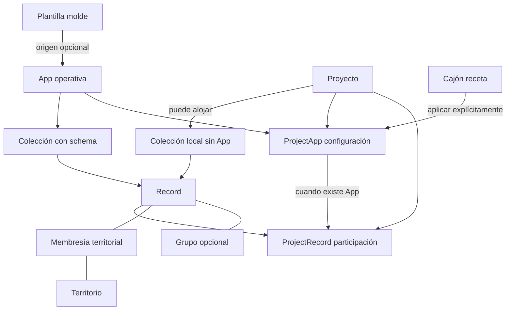

## Mapa 2 — Independencia

| Puede existir            | Sin necesitar                                         |
| ------------------------ | ----------------------------------------------------- |
| Plantilla                | App, Proyecto, Records                                |
| App                      | Plantilla, Proyecto, Cajón                            |
| Proyecto                 | App, Cajón, Records                                   |
| Cajón                    | Proyecto, datos                                       |
| Territorio/jerarquía     | App, Proyecto                                         |
| Record de App            | Proyecto/participación                                |
| Record local de Proyecto | App, pero sí colección/schema y participación inicial |
| Record no vinculado      | Grupo                                                 |

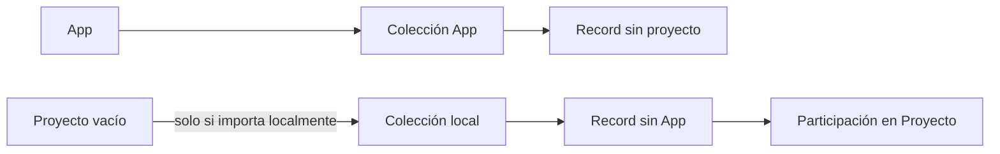

Independencia no significa datos sin schema ni autorización. La organización administra acceso a ambos casos.

## Mapa 3 — Creación desde App

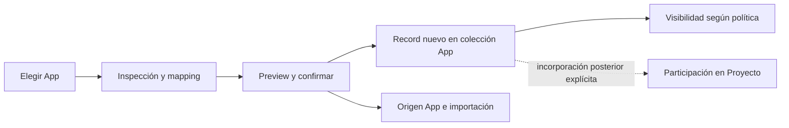

Ejemplo: importar P001 a App Postes no crea un proyecto artificial. Reimportar App requiere revisión y permiso de escritura del baseline.

## Mapa 4 — Creación desde Proyecto

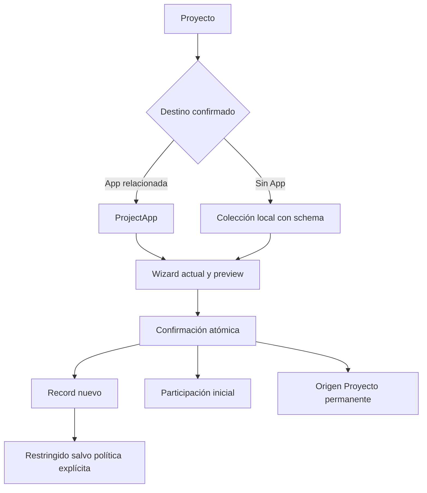

Sin App, no se crea una App escondida. Llevarlo posteriormente a App exige elección de migración compatible o consolidación; publicar por sí solo no lo mueve.

## Mapa 5 — App + varios Proyectos

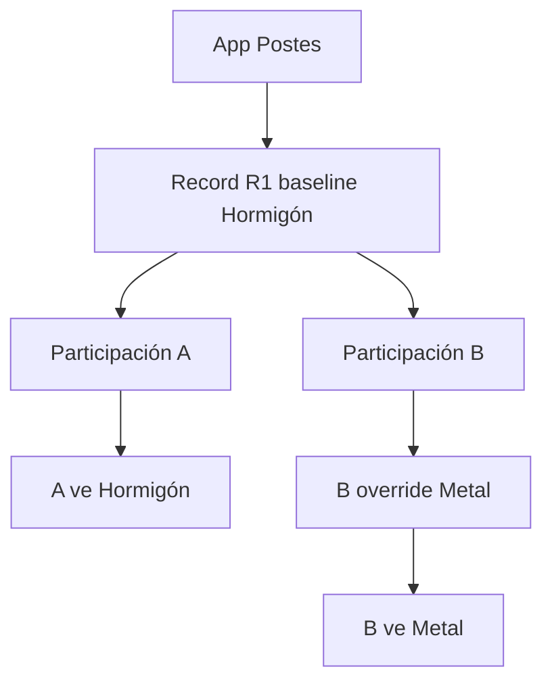

Un Record UUID, dos UUID de participación. Retirar B no borra R1 ni A. Si se crean dos representaciones independientes de la misma entidad, tendrán dos UUID y podrán vincularse: es un caso distinto.

## Mapa 6 — Territorios y jerarquías

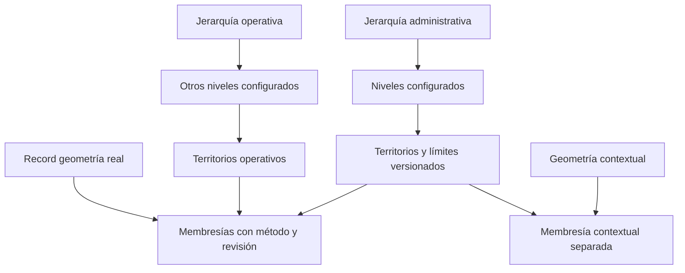

Una línea puede cruzar varios territorios. Un punto en frontera requiere regla. La asignación manual no se borra al recalcular. El icono del mapa no determina territorio.

## Mapa 7 — Mapa Universal

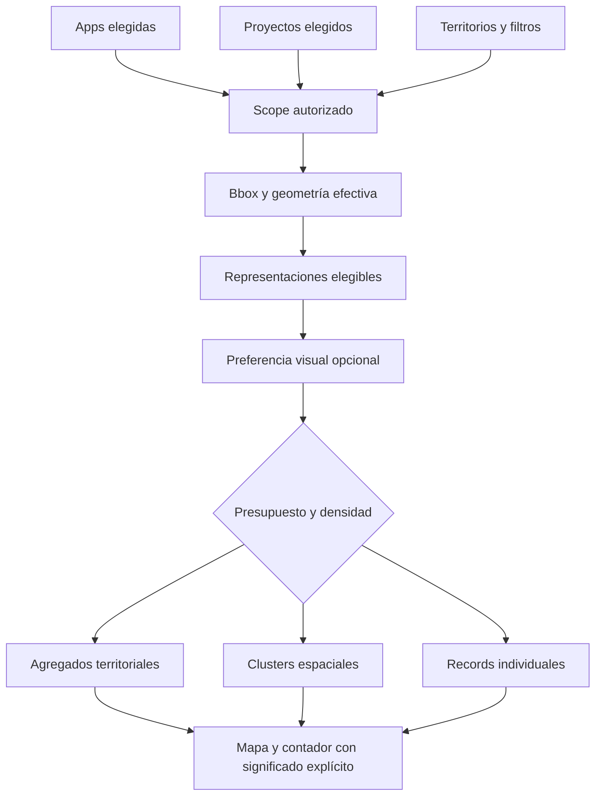

No se descargan millones de registros. El contador diferencia records, participaciones y símbolos; una línea asociada a dos territorios no es dos records. Tabla usa mismo scope, paginada; detalles completos se piden al seleccionar.

## Mapa 8 — Posibles duplicados: tres decisiones

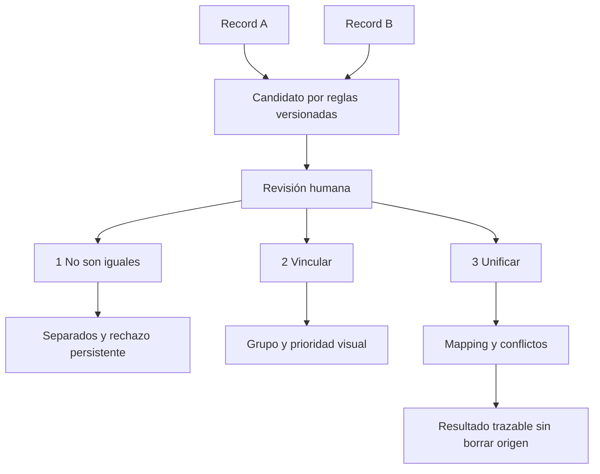

Misma coordenada no demuestra identidad. Un candidato pendiente no es vínculo. La detección no se ejecuta comparando todos los registros cada vez que se mueve el mapa.

## Mapa 9 — Vinculación y prioridad

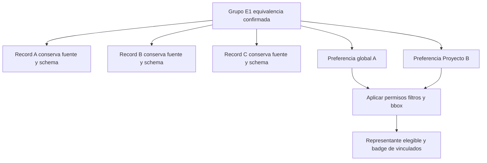

Vincular no modifica geometrías ni valores. Principal oculto/no elegible no aparece por ser principal. Desvincular elimina la relación activa, no el registro. Grupos con un rechazo previo entre miembros requieren resolver esa contradicción antes de unirse.

## Mapa 10 — Consolidación

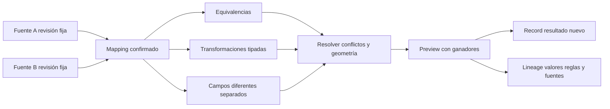

“Tipo” de material no es “Tipo” de estructura. “Poste de 9 metros” puede convertirse en Altura=9 mediante transformación confirmada. Los originales sobreviven; revertir resultado no borra las fuentes ni deshace cambios posteriores ajenos.

## Mapa 11 — Exportación

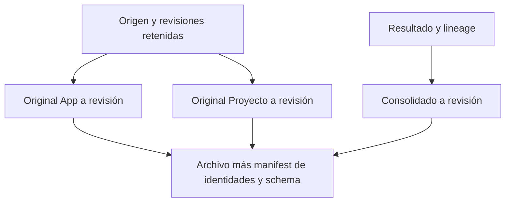

Exportar archivo exacto requiere conservar sus bytes. Exportar estado original requiere snapshot. Lo perdido antes de esta evolución no puede reconstruirse inventando procedencia. Vinculación visual no excluye records de exportación por defecto.

## Mapa 12 — Lecturas independientes

| Vista      | Fuente lógica                                              |
| ---------- | ---------------------------------------------------------- |
| App        | Records de su colección, sin PR obligatorio                |
| Proyecto   | participaciones activas y efectivos; App o colección local |
| Territorio | memberships/geometría del scope autorizado                 |
| Universal  | unión de representaciones autorizadas, acotada             |
| Record     | baseline/revisión y contexto opcional                      |
| Grupo      | miembros confirmados; valores separados                    |

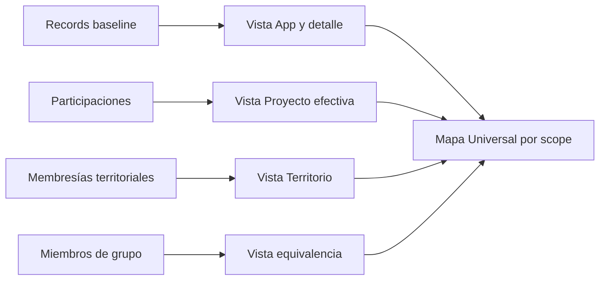

Las flechas a Universal son composición conceptual de read models, no N llamadas frontend ni descarga completa de cada vista.

## Mapa 13 — Arquitectura completa propuesta

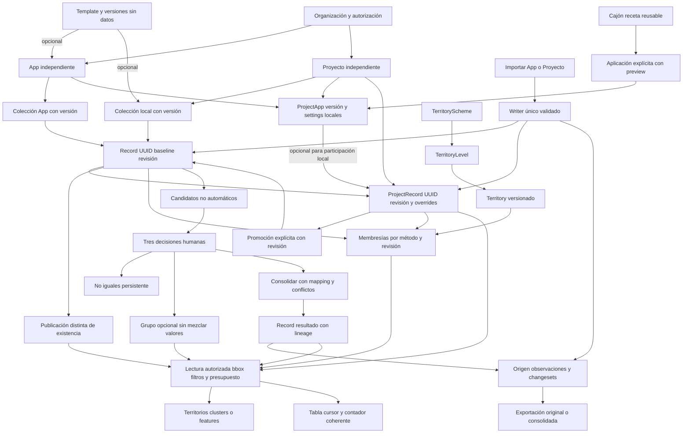

### Cómo evolucionaremos sin rehacerlo

Protección actual → identidad/revisión → Template/App/colección → Proyecto local → importación explícita → compartir/publicar/promover → territorios → mapa universal → vínculos → consolidación → retirar compatibilidad → certificar escala.

La fase de colecciones depende de confirmar B1. No se implementó ninguna flecha de estos diagramas en esta tarea. Se conservan datos existentes y se proponen migraciones incrementales, nunca reset.
