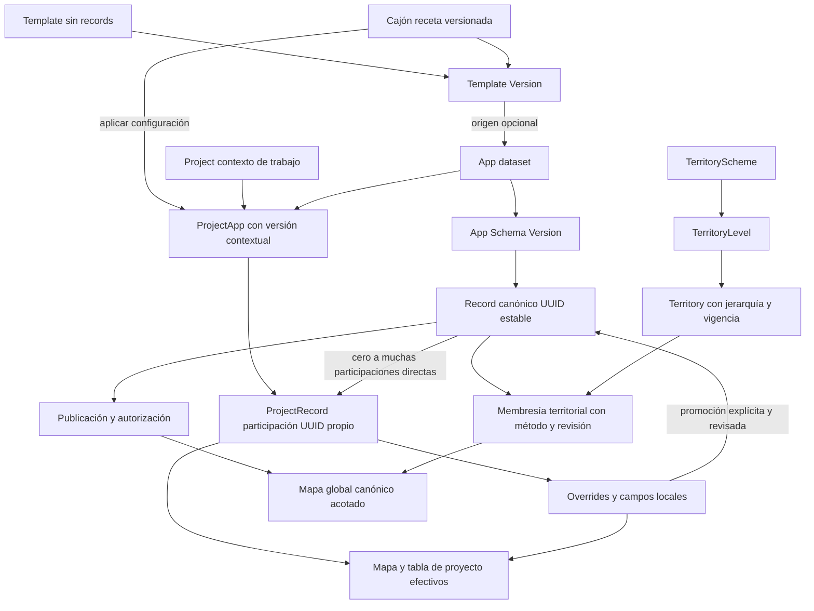

# Hansa Field — revisión de arquitectura de datos

Fecha: 2026-09-08. Estado: recomendación para decisión, **no implementación aprobada**.

## Alcance y conclusión ejecutiva

Revisión estática del repositorio local y del payload suministrado. No se modificaron código, migraciones ni datos. No se ejecutaron benchmarks: las conclusiones de escala son hipótesis de ingeniería, no garantías de latencia ni certificación de capacidad. Los índices inventariados son los declarados en el baseline del repositorio, no una certificación del catálogo de una base desplegada.

**Recomiendo C, con límites explícitos:** Template define; App es el dataset canónico; Record pertenece a una App y puede existir sin proyectos; ProjectRecord conserva la participación y sus diferencias locales; ProjectApp configura la vista operativa de una App dentro de un proyecto. Territorio es independiente. La lectura global no debe atravesar participaciones ni contar el mismo record varias veces.

No recomiendo eliminar ProjectRecord: el ejemplo de overrides distintos en A y B lo necesita. Tampoco recomiendo adoptar C añadiendo todas las tecnologías propuestas ahora. Primero deben resolverse identidad, versiones, propiedad y publicación. El problema de millones de registros no se resuelve cambiando nombres de tablas: requiere consultas selectivas y representación acotada.

## Evidencia del repositorio

Referencias relativas a este documento, con símbolos verificables:

| Referencia                                                                    | Evidencia inspeccionada                                                            |
| ----------------------------------------------------------------------------- | ---------------------------------------------------------------------------------- |
| [Baseline](../apps/api/src/database/migrations.ts)                            | `0001_project_app_foundation`, tablas, constraints e índices                       |
| [Persistencia](../apps/api/src/database/database.service.ts)                  | `pg.Pool`, SQL y `withTransaction`; no Prisma en este flujo                        |
| [Apps](../apps/api/src/apps/apps.service.ts)                                  | definición, settings, inserción y lectura de versiones                             |
| [Cajones](../apps/api/src/blocks/blocks.service.ts)                           | miembros versionados, retiro por `configuration.retired`, upsert                   |
| [Proyectos](../apps/api/src/projects/projects.service.ts)                     | `create`, copia de schema inicial, versiones propias                               |
| [Configuración](../apps/api/src/projects/project-apps.controller.ts)          | validación del schema recibido, rutas de versiones                                 |
| [Núcleo](../apps/api/src/records/project-records-core.service.ts)             | `create`, `incorporate`, `update`, `remove`                                        |
| [Resolver](../apps/api/src/records/effective-record.ts)                       | combinación de JSON por clave y geometrías con fallback                            |
| [Lecturas de proyecto](../apps/api/src/records/records.service.ts)            | `listProjectRecords`, `listMapFeatures`                                            |
| [Consolidado](../apps/api/src/records/consolidated-records.service.ts)        | filas de participaciones, metadata, mapa y búsqueda                                |
| [Importador](../apps/api/src/transfers/shapefile-imports.service.ts)          | `prepare`, `persistBatch`, job transaccional                                       |
| [Mapa web](../apps/web/src/features/maps/multi-app-map.tsx)                   | Leaflet, markers, bbox, cache de 12 respuestas                                     |
| [Workspace](../apps/web/src/features/workspace/workspace-pages.tsx)           | configuración y operación de proyectos                                             |
| [ADR histórico](decisions/0002-app-master-records-and-project-memberships.md) | expresa escritura maestra de campos base; no equivale a la edición local posterior |

### Hallazgos prioritarios, sin cambios

1. **La importación puede alterar el canónico compartido.** `persistBatch` hace `ON CONFLICT(id) DO UPDATE` de App, versión, atributos y geometría de `records`. Esto no implementa una reimportación exclusivamente local. La búsqueda por identidad externa en `prepare` usa perfil/versión/source ID, sin restringir proyecto. Puede reutilizar identidad entre contextos sin una decisión de incorporación explícita.
2. **El consolidado de App no es una colección canónica.** Parte de `project_records` activos, entrega overrides y puede devolver R1 varias veces. Un record sin participación activa no aparece allí.
3. **Identidad de campo y clave de almacenamiento están parcialmente separadas.** Schemas tienen `id`, pero valores y resolver usan claves técnicas. Las tablas `template_field_definitions` y `project_app_field_definitions` existen en baseline; la búsqueda en código no encontró escrituras operativas que las mantengan. No constituyen hoy una garantía activa de identidad.
4. **Versión contextual insuficientemente fijada.** ProjectApp tiene versiones, pero ProjectRecord no referencia una versión de schema contextual. `records.app_version_id` apunta a la versión maestra, no describe necesariamente campos añadidos al proyecto. Consultar siempre latest no permite interpretar inequívocamente valores históricos.
5. **La selectividad geográfica efectiva requiere trabajo.** Los GiST están en columnas individuales; el predicado principal usa `COALESCE` entre dos tablas. No puede asumirse que aproveche esos índices como una consulta directa a `records.geometry`.
6. **Dos políticas de clustering.** Proyecto usa amplitud de viewport mayor a 200 m; consolidado usa zoom menor a 18. Ambos agrupan por rejilla en grados y limitan la respuesta después de calcular agrupaciones. No existe política común de densidad.
7. **Contrato de PATCH destructivo por omisión.** Controller predetermina objetos ausentes a `{}` y servicio transforma geometría omitida en NULL. Una edición parcial puede borrar overrides previos. No es un conflicto de arquitectura fundamental, pero sí de semántica de actualización.
8. **Aislamiento de presentación incompleto.** Nombres, iconos y colores consultados para Project Apps vienen de `app_definitions`; un cambio maestro puede verse retroactivamente aunque el schema del proyecto sea propio.
9. **No hay publicación, territorios ni registro de cambios suficiente para sync.** No se encontraron sus entidades operativas en las áreas revisadas. Fechas e import sources no sustituyen revisiones y auditoría.

## 1. Arquitectura Hansa actual

Monolito modular NestJS y frontend Next.js/React; PostgreSQL/PostGIS mediante SQL manual parametrizado. No hay Prisma como capa de persistencia del modelo inspeccionado. Services combinan reglas y SQL; esto simplifica transacciones, pero permite que el importador escriba directamente saltándose reglas del núcleo de registros.

`app_definitions` mezcla blueprint y clasificación canónica. `app_versions` almacena schemas JSONB. Cajones fijan versiones maestras. Crear un proyecto instancia `project_apps` y copia el schema a `project_app_versions`; la unicidad proyecto/App evita duplicaciones de una misma maestra.

La base **ya** permite Record sin ProjectRecord: `records.app_id` es obligatorio; `origin_project_app_id` es nullable. No hay `records.project_id`. Sin embargo, creación operativa, import jobs y lecturas están centradas en Project Apps. Es dependencia funcional del proyecto, no propiedad impuesta por la FK del record.

Los nombres físicos actuales son `records.id`, `canonical_attributes`, `project_records.id` y `record_id`. Los UUID públicos traducen esas columnas. No asumir los nombres históricos `base_attributes` o `record_uuid` como columnas vigentes.

Rutas observadas: GET `/api/projects/:projectId/records`; GET `/api/map/records` con bbox/zoom/projectAppIds; GET `/api/apps/:appId/records`, `/metadata`, `/map`; POST/PATCH/DELETE `/api/project-apps/:projectAppId/records`; POST `/incorporate`; GET/POST versiones de Project App. El controlador de mapa admite omitir projectId, pero el SQL compara con NULL mediante `IS NOT DISTINCT FROM`: eso no produce un mapa global porque ProjectApp siempre tiene proyecto.

## 2. Arquitectura funcional observada de Fulcrum

El ejemplo muestra evento, owner del evento, record, form, versión de form, valores por identificadores, geometría, status, timestamps y changeset. `project_id: null` demuestra que ese record puede existir sin asociación de proyecto en el contrato observado. No demuestra tablas internas, política de permisos, cardinalidad total de asociaciones ni significado contractual completo de cada timestamp.

## 3. Diferencias entre ambas

Fulcrum expone directamente Form → Record con proyecto opcional. Hansa persiste Record → App, pero expone mayormente participaciones contextualizadas. Hansa añade múltiples participaciones y overrides, no evidenciados por ese payload. La diferencia no exige eliminar esta capacidad: exige abrir la operación canónica independiente.

## 4. Qué hace bien Fulcrum

Del ejemplo: separar ID del evento del registro, fijar referencia al formulario/versionado, separar valores de schema, admitir ausencia de proyecto y distinguir cambios/client/server. Son ideas útiles sin copiar sus nombres ni estructura interna.

## 5. Qué no deberíamos copiar

No reducir nuestras participaciones a un solo `project_id` nullable si necesitamos A y B simultáneos. No confundir `status` con entidad técnica global: AMPLIFICADORES en ese archivo es una clasificación de origen. No convertir códigos de campos específicos de un proveedor en identidad Hansa. La supuesta fragmentación obligatoria por nodos y las limitaciones de volumen de Fulcrum no están demostradas por el payload: se tratan como observación del usuario, no como hechos técnicos verificados del producto.

## 6. Definición propuesta de Template

Blueprint reutilizable, sin records. Versiones inmutables de campos, validaciones, geometrías admitidas, secciones y configuración inicial. Su identidad no es el nombre de una App. Dos datasets pueden usar la misma plantilla sin compartir registros ni permisos.

## 7. Definición propuesta de App

Dataset operativo con identidad, versión de schema propia, organización propietaria y política de publicación. Tiene cero o muchos records y puede originarse en Template. No crear una App por nodo para limitar render. Una App por finalidad, contrato o límite real de administración sí puede ser legítima. Conviene admitir App sin Template; la plantilla es origen, no requisito ontológico.

## 8. Definición propuesta de Record

Identidad Hansa estable dentro de un dataset: atributo canónico versionado, geometría canónica, revisión y estado de publicación. Puede representar inspección o incidencia, no solo objeto físico. Cambiar de proyecto no cambia UUID. Mover a otra App debe ser operación explícita con validación, no efecto colateral de reimportación. Duplicar como nuevo genera otro UUID.

## 9. Definición propuesta de Project

Contexto de trabajo: responsables, permisos, alcance y participaciones. No dueño implícito de datos ni partición obligatoria para rendimiento. Un territorio puede abarcar muchos proyectos y viceversa. Borrar/cerrar proyecto no debe borrar canónicos compartidos.

## 10. Definición propuesta de ProjectApp

Configuración operativa de **una App** dentro de un proyecto: versión base, versión contextual, campos locales, UI y simbología explícitamente fijada o heredada por política. Conserva identidad propia, pero no es otra fuente canónica. Rediseñar su referencia al separar Template/App. Mantener unicidad `(project, app)` mientras no exista necesidad real de múltiples configuraciones simultáneas del mismo dataset en un proyecto.

## 11. Definición propuesta de ProjectRecord

Participación directa de R1 en ProjectApp, con UUID propio, estado activo/retirado, deltas de atributos y geometría. Conservar entidad y constraint de una participación activa por `(project_app_id, record_id)`. No introducir variant/subvariant. Puede haber cero participaciones; la existencia del canónico no depende de ellas. Añadir en el diseño revisión contextual y referencia al schema interpretativo.

## 12. Definición propuesta de Cajón

Receta reusable, sin registros y sin territorio implícito. El modelo `app_blocks` + miembros versionados es aprovechable. Tras separar entidades, el miembro debe distinguir crear dataset desde template de vincular un dataset existente; aplicar un Cajón nunca debe duplicar millones de records. La configuración actual guarda retiro de miembros en JSON para no alterar provenance de Project Apps existentes. Para receta reproducible conviene versión/snapshot de Cajón; no es necesario ejecutarlo ahora.

## 13. Modelo territorial

TerritoryScheme identifica una jerarquía configurable; TerritoryLevel define nivel y reglas; Territory define instancia, parent, código, nombre, geometría opcional y vigencia. No hardcodear Nodo/Distrito. Prevenir ciclos, padres de otro esquema y saltos de nivel no permitidos. Un nodo de red sin área no se vuelve polígono ficticio: admite asignación administrativa/manual.

## 14. Múltiples jerarquías

Un record puede asociarse a territorios de varios esquemas. Recomiendo relación híbrida: geometría como evidencia espacial y membresías almacenadas con método, versión del territorio, revisión geométrica y prioridad. Asignación manual no debe perderse al recalcular. Almacenar hojas y resolver ancestros evita multiplicar filas por cada nivel; materializar ancestros solo por consulta justificada. Cambios de límites invalidan asociaciones derivadas, no la identidad del record.

## 15. POINT, LINESTRING y POLYGON

Relación Record ↔ Territory muchos-a-muchos. Puntos en borde requieren política explícita: `ST_Within` excluye el caso de estar solo sobre el borde; considerar `ST_Covers` para pertenencia inclusiva. Líneas y polígonos pueden intersectar varios territorios; no asignarlos solo por centroide. `ST_Intersects` sirve para candidatos de cruce; si importa cuánto pertenece, calcular longitud/área de intersección en CRS métrico adecuado. La geometría visual nunca decide pertenencia territorial real. [Semántica de ST_Intersects](https://postgis.net/docs/ST_Intersects.html), [ST_Within](https://postgis.net/docs/ST_Within.html), [ST_Covers](https://postgis.net/docs/ST_Covers.html).

Hoy canónico tiene `ST_IsValid`; overrides no tienen esa misma comprobación en baseline. La futura política debe ser uniforme. No confundir SRID asignado con reproyección. Considerar antimeridiano y geometrías multipartes como extensión explícita: baseline actual limita a los tres tipos simples.

## 16. Ownership de Record

App es pertenencia lógica principal; organización/tenant es propietario administrativo y límite de autorización. Project es participación. `origin_project_app_id` conserva procedencia, no privilegios perpetuos. Las lecturas deben validar tenant/ACL antes de agregación, conteo y detalle; CORS no cumple esa función. No se observan guards de autorización en los controladores revisados.

## 17. Canónico versus override

Global = canónico publicado autorizado. Proyecto = canónico + overrides + campos locales. El resolver debe mapear identidades y luego resolver presencia, no equiparar nombre con identidad. Ausencia hereda; null explícito puede borrar valor; reset de override restablece herencia. Para geometría, NULL actual significa heredar: si se quiere geometría local explícitamente vacía hará falta una operación/estado distinto.

Promoción recomendada: preview de diferencias → validación → aprobación autorizada → actualización canónica con revisión esperada → auditoría. Política automática solo para fuentes confiables y campos definidos. Otros proyectos sin override verán el nuevo canónico; eso debe ser consciente. Los que necesitan reproducibilidad fijan revisión/snapshot, no se convierten en maestros. Un override puede quedar redundante o conflictivo: no borrarlo automáticamente.

## 18. Publicación

Separar existencia, publicación y archivo. Preferir ejes independientes: visibilidad `restricted/published` y lifecycle `active/archived`, en vez de mezclar archivo con alcance. Record importado en proyecto puede existir canónicamente pero estar restringido. Sin participaciones activas y no publicado, retener según política; no exponer por accidente ni borrar automáticamente. Publicación requiere permisos y validación; retirar de un proyecto no equivale a despublicar globalmente.

## 19. Importación

Crear Record + participación inicial dentro de la misma transacción es correcto cuando se importa desde proyecto. Importar desde App crea Record y opcionalmente participación; no exige proyecto ficticio. Conservar wizard, inspección, clasificación, CRS, matching por nombre, mapping manual, preview y confirmación.

El destino debe resolver App canónica y ProjectApp opcional. Los campos solo locales van al contexto. Reimportación de proyecto actualiza participación, no canónico silenciosamente. Identidad externa debe incluir fuente/sistema/dataset y scope de idempotencia; no deduplicar globalmente solo por `_record_id` de un ZIP. Incorporar existente conserva UUID; duplicar nuevo no. Guardar mapping confirmado por IDs/versiones, no inferir equivalencia permanente del nombre.

El importador actual prepara filas en memoria, usa lotes de 250 dentro de una transacción completa y almacena original JSONB/geometry por procedencia. A millones requiere streaming/staging, validación por lotes, reanudación e idempotencia; no una transacción HTTP gigante. El historial de fuente actual hace upsert y sustituye datos previos: no es auditoría append-only.

## 20. Mapa global

Viable con PostGIS, no con el endpoint actual sin cambios. Consultar records canónicos publicados y autorizados, sin joins obligatorios a ProjectRecord. País → territorios → clusters → features es navegación posible, no exige que todos los datasets tengan territorio completo. Mantener fallback espacial para datos sin asignación. Definir límite de features, vértices y bytes además del número de filas.

## 21. Agregación territorial y multi-App

Una consulta agrupada por territorio y App, no N consultas independientes. Para escalas amplias y lecturas repetidas, resúmenes por esquema/nivel/territorio/App/publicación/revisión. Total de registros distintos no siempre es suma de territorios hijos: una línea puede cruzarlos. Mostrar separados conteo de records únicos, membresías y métricas de longitud/área. Cada agregado debe describir la métrica y scope; los ejemplos 9/60/400 son ilustraciones, no cardinalidades garantizadas.

## 22. Clustering: zoom más densidad

Decidir por bbox, presupuesto gráfico, densidad estimada y complejidad geométrica; zoom guía tamaño de celda, no decide solo. Leer hasta presupuesto+1 puede evitar COUNT total para decidir detalle. En zona rural 80 features caben; 30.000 urbanas se agregan. Rejilla en coordenadas de pantalla/proyección apropiada para estabilidad visual; no asumir metros uniformes por grado. Líneas/polígonos pueden simplificarse/recortarse en read model; puntos representativos en cluster deben identificarse como agregados, no geometrías reales. Evitar `ST_Collect` de millones cuando basta sumar coordenadas representativas y contar.

## 23. Map read model

Separar feature mínima de detalle: global `{recordUuid, appId, geometry, symbolId, label, revision}`; proyecto añade `{projectRecordUuid, projectAppId}`. Cluster tiene identidad de agregado y count, no UUID de registro inventado. Attributes completos, historia y proyectos se obtienen al seleccionar. El consolidado actual devuelve atributos efectivos en detalle del mapa; el mapa de proyecto es más compacto, pero usa `id/appId` ambiguos. Unificar semántica, no necesariamente todos los endpoints en una función enorme.

## 24. Tabla

Cursor/keyset por orden determinista `(updated_at,id)` y scope/filtro estable. OFFSET actual es admisible para páginas cortas pero empeora al avanzar; filas omitidas también cuestan trabajo. [Documentación PostgreSQL](https://www.postgresql.org/docs/current/queries-limit.html).

Tabla puede representar todos los registros del viewport mediante páginas, nunca cargarlos todos a la vez. El contador representa colección lógica, no markers/clusters recibidos ni filas de la página. Mapa y tabla comparten filtro normalizado, bbox y revisión de consulta. Cambiar bbox reinicia cursor; respuestas viejas se descartan. COUNT exacto por movimiento puede dominar latencia; separar cálculo asíncrono o usar resúmenes, indicando aproximación si la hay. Si el requisito exige exactitud, no sustituir silenciosamente por estimación. COUNT con ventana actual devuelve cero si se solicita una página vacía, aunque existan filas en páginas previas.

## 25. Índices reales y propuestos por consulta

| Actual, declarado                                  | Uso y límite                                                                            |
| -------------------------------------------------- | --------------------------------------------------------------------------------------- |
| PK UUID de records/project_records                 | acceso por identidad; no crear otro índice igual                                        |
| GiST `records.geometry`                            | bbox canónico y candidatos territoriales                                                |
| GIN `records.canonical_attributes`                 | consultas JSONB compatibles; no acelera `strpos(lower(json::text),...)` del consolidado |
| `(app_id,updated_at DESC)` records                 | lectura por App/orden; añadir id si se adopta cursor                                    |
| `(project_app_id,updated_at DESC)` parcial active  | listado por ProjectApp; desempate id no incluido                                        |
| UNIQUE parcial `(project_app_id,record_id)` active | duplicación de participación activa, no unicidad global del record                      |
| GiST overrides y display overrides                 | predicados directos sobre esas columnas; no garantía para COALESCE entre tablas         |
| `project_apps(project_id)` y unique proyecto/App   | scope de proyecto                                                                       |
| miembros `(block_id,position)`                     | orden/aplicación de Cajón                                                               |
| fuentes `(import_job_id)` + unique compuesto       | trazabilidad; búsqueda por record/proyecto puede necesitar otra orientación             |

No hay SP-GiST, índices de publicación o territorio en baseline. No recomendar SP-GiST además de GiST sin distribución y plan medido. Tipos de índice tienen operadores/propósitos diferentes. [PostgreSQL](https://www.postgresql.org/docs/current/indexes-types.html).

Candidatos justificados, no DDL: `(record_id,project_app_id)` parcial activo para consultar participaciones de un record/promoción; índice por record_id no parcial si historial/FK lo requiere. B-tree `(app_id,updated_at,id)` para cursor canónico; equivalente contextual. Publicación parcial con geometría para mapa publicado solo si selectividad lo justifica. Membresías territoriales `(territory_id,record_id)` y sentido inverso para navegación/recalcular; incluir scheme/revisión según contrato final.

Para geometría efectiva probar tres ramas mutuamente excluyentes: display propio; geometría override sin display; canónica sin overrides. Así se aplican predicados a columnas indexables y se evita duplicar resultados. Alternativa: proyección persistida indexada, con costo de fan-out al cambiar canónico. No existe índice de expresión simple sobre COALESCE de dos tablas. Validar con EXPLAIN (ANALYZE, BUFFERS), selectividad real y concurrencia antes de decidir.

## 26. JSONB versus columnas

Columnas para identidad, FK, revisión, estado, timestamps, geometría y filtros estables del sistema. JSONB para valores dinámicos por identidad de campo, preservando tipos. No EAV ni tabla física por App. ID estructural y clave amigable son conceptos distintos; un cambio de etiqueta no debe reescribir valores. No indexar cada atributo por defecto: índices de expresión para campos muy consultados y tipados, solo con evidencia. Overrides pequeños reducen duplicación, pero actualizaciones JSONB pueden generar WAL/TOAST y bloat: medir tamaños y frecuencia.

## 27. Cache

Frontend: respuestas acotadas, cancelación y clave de scope/bbox/zoom/filtros/versión. La cache actual de 12 URLs no tiene revisión de datos en la clave; inspeccionar invalidación tras editar antes de considerarla coherente. Cache del mapa base es independiente de datos Hansa y depende de licencia/proveedor; no descargar tiles masivamente sin permiso.

HTTP/tile cache para consultas repetibles, ETag y claves versionadas. Redis es opcional para agregados calientes, no fuente de verdad. Claves incluyen tenant/ACL, publicación, Apps, territorio/versiones y parámetros normalizados. Invalidación: canónico afecta global y contextos herederos; override solo contexto; mover geometría afecta celdas antigua/nueva; publicar/retirar afecta counts; cambiar límites incrementa revisión territorial. TTL limita obsolescencia, no resuelve autorización: cambios de permiso deben invalidar o cambiar clave inmediatamente.

## 28. GeoJSON versus MVT

GeoJSON sigue adecuado para edición, pocas features y geometrías simples, con presupuestos de bytes y vértices. MVT se justifica para navegación repetida, geometrías extensas y respuesta cacheable por tile, no por alcanzar un número mágico de records. PostGIS puede producir tiles binarios con `ST_AsMVT` y preparación geométrica con `ST_AsMVTGeom`; diseñar read model desacoplado permite transición. [PostGIS MVT](https://postgis.net/docs/ST_AsMVT.html).

Tiles no son fuente para editar geometrías: contienen recortes/simplificación. Mantener UUID como propiedad y no asumir que el feature ID entero MVT acepta UUID nativo. MapLibre sería una opción futura de renderer; no está implementado por el mero hecho de figurar en una arquitectura. No instalarlo ahora.

## 29. Offline

Territorios facilitan manifests de descarga con App, versión de schema, ámbito, revisión de límites y cursor de sincronización. No equivalen a permisos. Offline necesita tombstones, IDs cliente, cola idempotente, límites de adjuntos y política de conflictos. Una línea cruzando territorios se descarga una vez por UUID; límites de edición pueden diferir de límites de visualización. Reasignación territorial requiere retirar/agregar elementos al manifest sin perder cambios locales.

## 30. Changesets y sync

Hoy hay timestamps y jobs, pero no revisión monotónica/ETag de record, changeset ni auditoría suficiente de cada edición. Proponer revisión optimista por record y participación, operation UUID idempotente, actor, server timestamp, client timestamp no confiable y changeset que agrupe importación/promoción. Registro append-only de cambios y outbox transaccional cuando haya sincronización; no event sourcing completo. Conflicto se evalúa por revisión base y ámbito; los relojes cliente no deciden último escritor. Geo-merge automático no es seguro por defecto.

## 31. Escenarios de escala

Millones de participaciones activas, sin contar retiradas ni territorios:

| Records | Promedio 1 |     2 |     5 |    10 |
| ------: | ---------: | ----: | ----: | ----: |
|     1 M |        1 M |   2 M |   5 M |  10 M |
|     5 M |        5 M |  10 M |  25 M |  50 M |
|    10 M |       10 M |  20 M |  50 M | 100 M |
|    50 M |       50 M | 100 M | 250 M | 500 M |

La relación crece O(records × participaciones), no duplica necesariamente toda geometría ni atributos. Aun vacía, una participación cuesta fila, UUID, índices, WAL y mantenimiento. Ilustración de presupuesto, NO tamaño medido: 100 M × 300 bytes combinados serían 30 GB solo de participación; × 1 KB serían 100 GB. No incluye canónicos, índices adicionales, geometrías, fuentes, backups ni bloat. Medir con `pg_total_relation_size` y muestras reales antes de comprar RAM/discos.

| Escala | Riesgo predominante y criterio de preparación                                                                                                   |
| ------ | ----------------------------------------------------------------------------------------------------------------------------------------------- |
| 1 M    | joins selectivos y bbox; COUNT y filtros textuales ya pueden escanear demasiado                                                                 |
| 5 M    | importación en memoria y OFFSET profundos; pipeline por lotes reanudable y cursor                                                               |
| 10 M   | agregados amplios y 100 M participaciones posibles; lectura global sin join a PR, cache/versiones y presupuestos                                |
| 50 M   | hasta 500 M participaciones; capacidad I/O, índices calientes, vacuum, WAL, retención e invalidación; evaluar partición/replicas con mediciones |

No es necesario que todos los datos quepan en RAM: sí importa working set de índices y regiones calientes. Geometrías con muchos vértices pueden pesar más que millones de puntos. Medir p50/p95/p99, bytes, CPU, buffers, tiempo de COUNT, filtros selectivos/no selectivos, tormentas de pan/zoom, importación y edición concurrentes. Definir SLO antes del benchmark. Límite de respuesta no limita trabajo previo de GROUP BY/COUNT. Particionar por proyecto no resuelve lectura canónica global y puede multiplicar índices; no hacerlo por intuición.

## 32. Opción A — actual optimizado

Menor migración; conserva ProjectApp operativa y añade mejoras SQL/mapa. Sirve si toda operación requiere proyecto. No satisface bien records independientes ni mapa global único sin introducir un camino canónico adicional. Persistir App y resolver desde participaciones sigue mezclando dataset con plantilla. Optimizar índices no corrige ese significado.

## 33. Opción B — Fulcrum-like

App/form version → record, project_id opcional. Sencillo para un solo contexto o tags. No representa overrides simultáneos A/B sin tablas extra; al agregarlas se aproxima a C. No inferir de un payload que Fulcrum carezca de otras capacidades. B describe aquí una alternativa conceptual mínima, no sus tablas reales.

## 34. Opción C — Global Hansa

Template → App → Record; Record ↔ Project mediante ProjectApp/ProjectRecord; Record ↔ Territory. Satisface independencia, publicación y reutilización local. Mayor disciplina de versiones, permisos y promoción. Evitar duplicar schema ownership de forma ambigua: App schema canónico y ProjectApp schema contextual tienen responsabilidades diferentes.

## 35. Opción D — sin entidad Template separada

App operacional con versiones y operación de clonar definición, sin Template persistente. Reduce entidades y migración; útil si no se gobiernan plantillas compartidas. Pierde separación explícita entre catálogo reusable y datasets y complica la intención actual de Cajones. Es alternativa válida, no superior para el caso planteado.

## 36. Comparación

| Criterio                               | A                 | B mínimo         | C          | D                    |
| -------------------------------------- | ----------------- | ---------------- | ---------- | -------------------- |
| Record sin proyecto, operación natural | Débil             | Sí               | Sí         | Sí                   |
| Overrides múltiples                    | Sí                | No               | Sí         | Sí con participación |
| Blueprint sin registros                | Ambiguo           | No definido      | Explícito  | No                   |
| Global sin duplicados                  | Trabajo adicional | Sí               | Sí         | Sí                   |
| Migración desde hoy                    | Baja/media        | Alta y regresiva | Media/alta | Media                |
| Escala garantizada por modelo solo     | No                | No               | No         | No                   |

La decisión se basa en semántica y acceso, no en que C tenga más entidades. Para el requisito real recomiendo C; para un producto sin templates gobernados, D sería más simple.

## 37. Arquitectura recomendada

C dentro del monolito modular. Record existe independientemente de ProjectRecord. App posee el canónico; ProjectRecord posee deltas contextualizados. Un módulo de dominio de registros centraliza validación/escritura; importador lo utiliza mediante contrato, no SQL de canónico paralelo. Query services/read models pueden ser especializados, pero comparten significado y autorización.

## 38. Qué mantener

UUID canónico/participación, PostGIS, JSONB dinámico, constraints de participación activa, retiro lógico, transacciones, versiones propias de Project App, Cajones no retroactivos, wizard y mapping flexible. Mantener filtros por ProjectApp en proyecto, no reinterpretarlos como IDs maestros. Reusar pruebas de aislamiento y extenderlas al nuevo alcance canónico cuando se implemente.

## 39. Qué cambiar

Separar rol Template/App; lectura global directa; importación y promoción; identidad de campos en persistencia; versión contextual y semántica PATCH; política de simbología heredada. Resolver planificación espacial efectiva, counts y cursor. Cambiar ADR-0002 en futura decisión explícita: su frase de actualización maestra desde campos base contradice el objetivo de overrides normales. Este documento no lo sustituye automáticamente.

## 40. Qué eliminar

Eliminar dependencia funcional de proyecto obligatorio para crear/leer canónico; eliminar upsert canónico silencioso en importación contextual; eliminar ambigüedad de `appId` donde significa participación operativa. No borrar records, project_records ni tablas por esta revisión. Las tablas de campos sin uso no deben mantenerse como falsa garantía: activarlas como autoridad o retirarlas tras definir otra estrategia, no ambas a la vez.

## 41. Qué agregar: ocho cambios estructurales

Conteo de **ocho decisiones/cambios de contrato**, no ocho tablas ni ocho migraciones:

1. Separación Template/App con versiones y FK explícitas.
2. Operación canónica independiente y ProjectApp referida al dataset.
3. Identidad persistente de campos, mappings reconocidos y versión contextual.
4. Publicación/lifecycle y propiedad administrativa/autorización.
5. Territorios configurables, múltiples esquemas y membresías con procedencia.
6. Revisiones, changesets e idempotencia para record/participación.
7. Separación de importación contextual, incorporación y promoción canónica.
8. Contrato de lectura global/proyecto, features mínimas, conteos/cursor y scopes comunes.

Redis, MVT y particionado no forman parte de este conteo obligatorio.

## 42. Decisiones que tomar ahora

Aprobar App como dataset; Record sin proyecto; si crear proyecto instancia dataset nuevo o vincula existente (recomiendo vincular explícitamente, nunca adivinarlo por nombre); unicidad de participación; schema canónico/contextual; identidad de campo y null/reset; políticas iniciales de publicación y promoción; organización propietaria; namespace de fuentes externas. Definir si proyecto hereda canónico vivo o permite snapshot fijado. Reservar contrato de revisión aunque offline llegue después.

## 43. Decisiones posponibles

Implementación MVT, renderer nuevo, Redis, materializaciones, partición física, réplicas y offline. El diseño territorial se decide conceptualmente ahora, su desarrollo puede venir después de asegurar identidad. No crear índices especulativos. Medir primero el acceso geográfico canónico y contextual con dataset representativo.

## 44. Riesgo y costo de migración

Riesgo mayor: decidir qué parte de los actuales atributos canónicos pertenece realmente a schema maestro versus campos introducidos en proyecto. No se puede reconstruir siempre intención histórica desde una clave técnica. Tampoco asumir que dos records con mismo ID externo son el mismo dato si cambió fuente.

Reutilizar `records` como canónico y `project_records` como participación. `app_definitions` puede convertirse en App operacional preservando IDs de records y extraer Template desde schemas actuales; alternativamente renombrarla Template obliga redirigir más FK. Recomiendo preservar identidad operacional de registros y crear referencias de origen de plantilla, con tabla de correspondencias auditada durante la migración futura. No hacer rename mecánico de toda App a Template.

Secuencia futura, no ejecutada: decisión aprobada → inventario real/versiones → mapping de identidades → respaldo → transformación con reconciliación de counts/FK → prueba A/B, independiente, publicación y reimportación → cutover. No hay autorización de reset en esta tarea. Costo medio/alto por importación y semántica histórica; bajo costo relativo en conservar participación. No estimar días sin medir datos, permisos y compatibilidad requerida.

## 45. Diagrama final propuesto

### Cierre

Auditoría estática completada; viabilidad de escala condicionada a consultas/read models y mediciones. No se certifica que el sistema actual soporte 10 M o 50 M. Solo se creó este documento. No se ejecutaron pruebas que alterasen datos ni migraciones.
